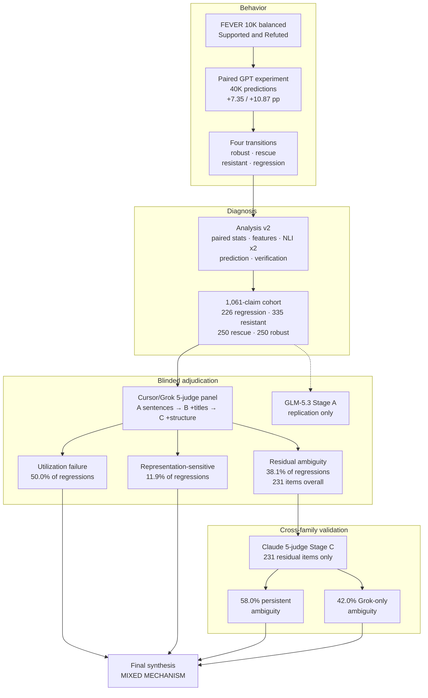

# Evidex

Evidex asks when designated gold evidence helps or harms LLM fact-checking, and what mechanisms explain cases where a model is correct without evidence and wrong after receiving it.

The primary experiment evaluates GPT-5.4 and GPT-5.4-mini on 10,000 balanced FEVER Supported/Refuted claims, each seen once without evidence and once with gold evidence (40,000 predictions). Evidence raises accuracy substantially, but a small set of claims regress. Later layers decompose those paired transitions, adjudicate a diagnostic cohort under blinded progressive disclosure, and test only the remaining ambiguous cases with a second model family. All adjudication is automated silver judgment, not human annotation, and does not relabel FEVER gold.

The map below is the research logic, not a file tree.



## Key Findings

Denominators are not interchangeable. Claude did not re-judge the full silver panel, and Claude does not reopen the Cursor regression taxonomy.

| Finding | Result | Denominator |
|---|---|---|
| GPT-5.4 evidence gain | 88.69% → 96.04% (**+7.35 pp**) | 10,000 claims |
| GPT-5.4-mini evidence gain | 84.67% → 95.54% (**+10.87 pp**) | 10,000 claims |
| Unique regressions | **226** claims (40 both models, 186 exactly one) | claims, not model-observations |
| Cursor/Grok Stage C mechanism | **50.0%** utilization failure · **38.1%** residual ambiguity · **11.9%** representation-sensitive | regressions in the silver panel |
| Claude residual split | **58.0%** persistent (134/231) · **42.0%** Grok-only (97/231) | 231 Stage C leftovers across cohorts |

The supported mechanism assessment is mixed: evidence-utilization failure, warrant ambiguity, a smaller representation-sensitive share, and model-family-specific conservatism in part of the residual. That is not a claim about GPT internals, human validation, or FEVER annotation error.

## How the Investigation Works

1. **Primary paired experiment (complete).** 10,000 balanced FEVER claims, two models, two conditions, 40,000 predictions. Gold evidence helps in aggregate and occasionally induces a correct-to-wrong regression. An earlier 1,000-claim run is a historical pilot only.
2. **Analysis v2.** Paired transition analysis of rescue, robust, resistant, and regression, plus features, two local NLI diagnostics, predictive models, leakage checks, and independent headline verification. NLI is a diagnostic, not ground truth. Details: [`FINDINGS.md`](analysis_v2/reports/FINDINGS.md), [`METHODS.md`](analysis_v2/reports/METHODS.md).
3. **Blinded silver adjudication.** Analysis v2 yields a 1,061-claim cohort (226 / 335 / 250 / 250). One provider-filtered item leaves judged N = 1,060. Five isolated `cursor-grok-4.6-high-fast` judges see Stage A sentences, then titles, then reconstructed structure. A frozen GLM-5.3 Stage A panel is a side replication, not the completed A→B→C panel. Details: [`SILVER_FINDINGS.md`](silver_adjudication_v1/cursor_panel/reports/SILVER_FINDINGS.md).
4. **Claude cross-family residual test.** Only the 231 Cursor Stage C Ambiguous/Unresolved items (not 231 regressions) go to five isolated `claude-opus-5-thinking-high` judges on the same Stage C evidence. Most of that residual stays ambiguous across families; a large slice does not. Details: [`CLAUDE_FINDINGS.md`](silver_adjudication_v1/claude_residual_panel/reports/CLAUDE_FINDINGS.md), [`CROSS_FAMILY_SYNTHESIS.md`](silver_adjudication_v1/claude_residual_panel/reports/CROSS_FAMILY_SYNTHESIS.md), [`FINAL_EVIDEX_STRENGTHENING.md`](silver_adjudication_v1/claude_residual_panel/reports/FINAL_EVIDEX_STRENGTHENING.md).

## Research Artifacts

| Artifact | Purpose |
|---|---|
| [`analysis_v2/reports/FINDINGS.md`](analysis_v2/reports/FINDINGS.md) | Paired-transition results, confirmatory vs exploratory findings |
| [`analysis_v2/reports/METHODS.md`](analysis_v2/reports/METHODS.md) | Pairing, features, NLI, models, verification |
| [`SILVER_FINDINGS.md`](silver_adjudication_v1/cursor_panel/reports/SILVER_FINDINGS.md) | Cursor/Grok A→B→C panel and regression mechanism split |
| [`CLAUDE_FINDINGS.md`](silver_adjudication_v1/claude_residual_panel/reports/CLAUDE_FINDINGS.md) | Claude residual Stage C panel |
| [`CROSS_FAMILY_SYNTHESIS.md`](silver_adjudication_v1/claude_residual_panel/reports/CROSS_FAMILY_SYNTHESIS.md) | Cursor vs Claude residual comparison |
| [`FINAL_EVIDEX_STRENGTHENING.md`](silver_adjudication_v1/claude_residual_panel/reports/FINAL_EVIDEX_STRENGTHENING.md) | Layer-by-layer synthesis and mixed-mechanism assessment |
| `experiment_summary_balanced_10000_v1.csv` | Committed 10K accuracy table |
| `analysis_v2/tables/verification.md` | Independent recomputation of Analysis v2 headlines (69/69 PASS) |

## Reproduction

Committed summaries, tables, freezes, and reports are enough to read the findings. The 10,000-claim GPT experiment is already finished.

```powershell
python -m pip install -r analysis_v2/requirements.txt
python -m spacy download en_core_web_sm
cd analysis_v2
python run_all.py
python -m unittest discover -s tests
python src/verify_headlines.py
```

```powershell
cd silver_adjudication_v1
python -m pip install -r requirements.txt
python -m unittest discover -s tests
python src/verify_headlines.py --panel cursor
python claude_residual_panel/src/verify_headlines.py
```

Judge inference is complete. Re-running judges is not required to inspect the findings.

<details>
<summary>Regenerate the original 10K paired experiment (already executed)</summary>

Requires `OPENAI_API_KEY` and local FEVER wiki shards. This rebuilds a completed run; it is not unfinished work.

```powershell
python -m pip install -r requirements-openai.txt
python prepare_fever_wiki_pages.py
python extract_fever_balanced_sample.py
python resolve_gold_evidence.py
python expand_experiment_runs.py
python run_fact_check_experiment.py
python analyze_experiment_results.py
```

</details>

## Limitations

- **Automated judges, not humans.** Cursor/Grok, GLM, and Claude panels are model-based silver labels. Cross-family replication reduces the risk that findings reflect one judge family, but it is not a substitute for expert human adjudication.
- **FEVER remains the gold standard.** NLI disagreement and model-judge disagreement flag candidate ambiguity. They do not establish that a FEVER label is incorrect.
- **No causal claim about GPT internals.** Progressive disclosure locates where a judge panel's warrant changes. Original GPT runs recorded labels only.
- **Binary, 2017-era FEVER.** The design excludes NOT ENOUGH INFO and is Wikipedia-based and entity-centric. The original prompt used sentence-only gold evidence.
- **Shared GPT family.** Both experiment models are GPT-5.4 variants.
- **Claude sample is residual-conditioned.** The 231 items are Grok Stage C leftovers, not a re-run of the 1,060-item panel.

Fuller lists: [`analysis_v2/reports/LIMITATIONS.md`](analysis_v2/reports/LIMITATIONS.md), [`cursor_panel/reports/LIMITATIONS.md`](silver_adjudication_v1/cursor_panel/reports/LIMITATIONS.md), [`claude_residual_panel/reports/LIMITATIONS.md`](silver_adjudication_v1/claude_residual_panel/reports/LIMITATIONS.md).

## License

This project is licensed under the MIT License. See [`LICENSE`](LICENSE).
