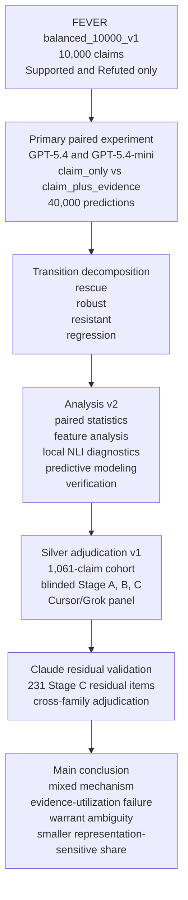

# Evidex

Evidex investigates when external evidence helps or harms large-language-model fact-checking, and what mechanisms explain evidence-induced failures. The primary experiment evaluates GPT-5.4 and GPT-5.4-mini on 10,000 balanced FEVER Supported/Refuted claims under two paired conditions, claim-only versus claim plus designated gold evidence, producing 40,000 predictions. Gold evidence raises accuracy substantially, but a small cohort of claims that were correct without evidence become wrong after it is provided. [`analysis_v2/`](analysis_v2/) decomposes those paired transitions with confirmatory statistics and exploratory diagnostics. [`silver_adjudication_v1/`](silver_adjudication_v1/) then tests mechanism hypotheses with blinded progressive disclosure and isolated multi-judge panels. A Cursor/Grok panel finds a mixed mechanism involving evidence-utilization failure, warrant ambiguity, and a smaller representation-sensitive component. A Claude-family residual Stage C panel provides cross-family validation of the remaining ambiguous cases and further separates persistent warrant difficulty from model-family-specific conservatism. These panels are model-based silver labels, not human annotation, and they do not relabel FEVER gold.

The diagram below summarizes how the main Evidex layers build on one another.



## Research Question

When does designated gold evidence help or harm LLM fact-checking on FEVER, and what mechanisms explain the cases where a model is correct without evidence and wrong after receiving that evidence?

The original paired experiment measures the aggregate effect of gold evidence. The later layers ask a finer question: among natural, unperturbed failures, how much of the damage is evidence-utilization failure, how much is representation-sensitive (titles or structure missing from the original prompt), and how much is residual warrant ambiguity? Local NLI disagreement, silver-panel ambiguity, and FEVER disagreement are treated as diagnostics, not as proof that a FEVER label is wrong.

## Experimental Design

Primary corpus: `balanced_10000_v1`.

| Design choice | Value |
|---|---|
| Source | FEVER `shared_task_dev.jsonl` |
| Labels | Supported and Refuted only (no NOT ENOUGH INFO) |
| Sample | 10,000 claims, 5,000 per label, seed 42 |
| Evidence | Shortest complete gold evidence set, resolved to prompt-ready text |
| Conditions | `claim_only`, `claim_plus_evidence` |
| Models | `gpt-5.4`, `gpt-5.4-mini` |
| Pairing | Same claim under both conditions for each model |
| Predictions | 40,000 (10,000 claims × 2 models × 2 conditions) |
| Valid rows | 40,000 / 40,000 |

Each claim therefore has a within-claim control: the claim-only prediction. The four transition classes used throughout later analysis are:

| Class | Claim-only | Claim + evidence |
|---|---|---|
| Rescue | wrong | correct |
| Robust | correct | correct |
| Resistant | wrong | wrong |
| Regression | correct | wrong |

An earlier 1,000-claim balanced run (`balanced_1000_v1`) was the completed pilot. It showed the same directional evidence gain and is retained only as historical context. All headline results below come from the completed 10,000-claim experiment.

## Headline Results

Source: `experiment_summary_balanced_10000_v1.csv`, `experiment_metrics_balanced_10000_v1.csv`, and the independent recomputation in `analysis_v2/tables/verification.md` (69/69 checks PASS). Confirmatory items are tagged **[C]**.

| Model | Claim-only | Claim + evidence | Gain |
|---|---:|---:|---:|
| gpt-5.4 | 88.69% (8,869 / 10,000) | 96.04% (9,604 / 10,000) | **+7.35 pp** |
| gpt-5.4-mini | 84.67% (8,467 / 10,000) | 95.54% (9,554 / 10,000) | **+10.87 pp** |

Condition-level aggregate: claim-only 86.68% (17,336 / 20,000); claim-plus-evidence 95.79% (19,158 / 20,000); overall 91.23% (36,494 / 40,000).

| Transition **[C]** | gpt-5.4 | gpt-5.4-mini |
|---|---:|---:|
| Robust | 8,754 | 8,316 |
| Rescue | 850 (8.5%, CI [7.92, 9.04]) | 1,238 (12.4%, CI [11.73, 13.00]) |
| Resistant | 281 | 295 |
| Regression | 115 (1.15%, CI [0.95, 1.36]) | 151 (1.51%, CI [1.28, 1.75]) |
| McNemar χ² (rescues vs regressions) | 558.3, p ≈ 2e-123 | 849.1, p ≈ 1e-186 |
| Rescue rate of claim-only errors | 75.2% | 80.8% |

Unique-claim regression counts (claims, never model-observations): 226 regress for at least one model, 40 for both, 186 for exactly one.

Cross-model agreement **[C]** rises from 89.3% (κ = 0.786) without evidence to 97.2% (κ = 0.944) with it. 87.3% of claims share the same transition class.

## Evidence-Induced Failure Analysis

[`analysis_v2/`](analysis_v2/) is a secondary, local analysis of the frozen 40,000 predictions. It does not rerun GPT and does not use paid APIs. The original experiment artifacts are read-only; derived data live under `analysis_v2/data/`.

The layer contributes:

1. **Paired transition decomposition** of rescue, robust, resistant, and regression, with McNemar tests, bootstrap confidence intervals, and unique-claim accounting.
2. **Linguistic and evidence-structure features** (lengths, overlap, numbers, dates, entities, evidence-set size).
3. **Semantic similarity** via local `all-MiniLM-L6-v2` embeddings. Mean claim-evidence cosine is 0.589 in GPT-5.4 regressions versus 0.613 overall. Similarity is a weak diagnostic.
4. **Two local NLI diagnostics** on (evidence → claim): `nli-deberta-v3-small` and `distilbert-base-uncased-mnli`. These are exploratory **[E]** and are never treated as ground truth.
5. **Interpretable predictive models** (logistic regression and shallow trees) with claim-level GroupKFold, plus a leakage audit and duplicate-aware CV.
6. **Independent headline verification** (`tables/verification.md`) and a 250-claim manual-review export with blank human-judgment columns. No human labels are filled in.

Exploratory **[E]** results that structure the later adjudication:

- Primary NLI disagreement with the FEVER-implied class is 22.6% among GPT-5.4 robust successes, 31.5% among rescues, 75.8% among resistant failures, and **74.8% among regressions** (75.5% flagged weakly warranted). Mini regressions: 76.8%. The second NLI model reproduces the ordering (robust 26.2%, GPT-5.4 regressions 67.8%, mini 73.5%). The two diagnostics agree on the disagreement flag for 84.3% of claims. Weakly warranted claims (n = 2,462) also have lower claim-only accuracy (81.0% vs 88.7% for GPT-5.4).
- Label asymmetry is model-dependent. GPT-5.4 evidence-condition errors are 238 Supported→Refuted versus 158 Refuted→Supported; it regresses on 88 Supported versus 27 Refuted claims. Mini reverses the raw error direction (201 vs 245) and shows no regression-label asymmetry (74 vs 77).
- With NLI and cosine features, GroupKFold ROC-AUC is 0.60-0.72 for rescue/regression and 0.84 for resistant (shallow tree). Surface features alone drop regression AUC to about 0.53-0.60. Duplicate-aware regrouping changes AUCs by at most 0.041, so duplicate leakage does not explain the result.
- Evidence-resistant failures share structure with regressions (about 75% NLI disagreement versus about 23% for robust).

See [`analysis_v2/reports/FINDINGS.md`](analysis_v2/reports/FINDINGS.md) and [`analysis_v2/reports/METHODS.md`](analysis_v2/reports/METHODS.md). Figures are in `analysis_v2/figures/`.

## Blinded Silver Adjudication

[`silver_adjudication_v1/`](silver_adjudication_v1/) is a blinded, freeze-before-unblind silver layer over the Analysis v2 cohorts. It is **not** human ground truth and **not** a claim that FEVER labels are wrong.

**Cohort.** 1,061 unique claims: all 226 regressions, 335 resistant, and 250 matched rescue plus 250 matched robust controls. One provider-filtered item (`SA-000352`) is excluded, so judged N = 1,060.

**Protocol.** Five isolated judges see only claim and evidence, through three progressive-disclosure stages:

| Stage | What the judge sees |
|---|---|
| A | Sentence-only gold evidence (the same prompt-ready text the GPT models saw) |
| B | Stage A plus FEVER page titles |
| C | Reconstructed structured FEVER evidence (titles, set boundaries, sentence indices, alternative complete sets). No new retrieval. |

Judgments are hashed and frozen before any join to GPT transitions, FEVER labels, or NLI scores. Opaque IDs carry no cohort or label signal.

**Completed Cursor/Grok panel.** All five judges, all three stages, and the resolver used one locked model, `cursor-grok-4.6-high-fast`. Within-panel agreement is same-family agreement.

| Stage | Pairwise agreement | Fleiss κ | Consensus |
|---|---:|---:|---|
| A | 89.8% | 0.846 | Refuted 403 / Supported 349 / Ambiguous 277 / Unresolved 31 |
| B | 95.3% | 0.928 | Refuted 423 / Supported 375 / Ambiguous 241 / Unresolved 21 |
| C | 95.4% | 0.928 | Refuted 437 / Supported 392 / Ambiguous 212 / Unresolved 19 |

Ambiguity (Ambiguous + Unresolved) falls 29.1% → 24.7% → 21.8% overall, and 45.6% → 42.0% → 38.1% among regressions. After Stage C, 61.9% of regressions are high-consensus Supported or Refuted, versus 96.4% of robust controls.

**Mechanism decision: mixed.** Do not force a single mechanism.

| Mechanism (regressions, Cursor Stage C taxonomy) | Share |
|---|---:|
| Evidence-utilization failure (high-consensus decisive warrant) | 50.0% |
| Residual warrant ambiguity (still Ambiguous/Unresolved) | 38.1% |
| Representation-sensitive (titles or structure change the warrant) | 11.9% |

Titles do not preferentially resolve regressions (7.1% vs 6.0% of robust). Structure-only resolution is real but small (5.3% of regressions vs 0.4% of robust). Shared regressions are more likely to remain ambiguous after Stage C.

**GLM Stage A replication.** A separate frozen GLM-5.3 Stage A panel is compared to Cursor Stage A only. Modal verdict agreement is 0.862; Cursor is more ambiguity-conservative (29.1% vs 22.3%). Partial GLM Stage B is provenance only and is excluded from A→B→C math. This is replication, not human validation.

Findings: [`silver_adjudication_v1/cursor_panel/reports/SILVER_FINDINGS.md`](silver_adjudication_v1/cursor_panel/reports/SILVER_FINDINGS.md).

## Cross-Family Residual Validation

The Cursor panel named one follow-up: a different model family, Stage C only, on the 231 residual Ambiguous/Unresolved items. That experiment is complete in [`silver_adjudication_v1/claude_residual_panel/`](silver_adjudication_v1/claude_residual_panel/).

Design: five isolated `claude-opus-5-thinking-high` judges, residual items only, same reconstructed Stage C evidence, no new retrieval, no resolver. Judges did not see Cursor/Grok, GLM, FEVER, GPT, NLI, or cohort labels, and were not told the items were residuals. Primary result is raw five-judge consensus (1,155 judgments). This is cross-family residual validation, not human annotation.

| Claude residual result | Value |
|---|---|
| Persistent Ambiguous/Unresolved | **58.0%** (134 / 231; CI 51.5-64.1) |
| Claude high-consensus decisive (Grok-only ambiguity) | **42.0%** (97 / 231) |
| Claude-internal consensus-taxonomy disagreement | 0 |
| Exact consensus-label agreement with Cursor | 56.3% |
| Residual regressions that persist | 68.6% (86 items) |
| Residual resistant items that persist | 53.6% (112 items) |
| Shared GPT regressions that persist | 75.0% (24 items; small subgroup) |

Of the 97 Claude-decisive items, 62/97 (63.9%) match FEVER gold and 35/97 do not. FEVER disagreement is not a license to relabel the benchmark.

The residual is therefore also mixed: most leftover items still look underdetermined to a second generative family, while a large high-consensus slice does not. Claude does not reopen the full-panel utilization-failure or representation-sensitive shares.

See [`CLAUDE_FINDINGS.md`](silver_adjudication_v1/claude_residual_panel/reports/CLAUDE_FINDINGS.md) and [`CROSS_FAMILY_SYNTHESIS.md`](silver_adjudication_v1/claude_residual_panel/reports/CROSS_FAMILY_SYNTHESIS.md).

## Repository Structure

```text
evidex/
├── experiment_results_balanced_10000_v1.csv   # 40,000 frozen GPT predictions
├── experiment_summary_balanced_10000_v1.csv
├── experiment_metrics_balanced_10000_v1.csv
├── fever_balanced_10000_v1_source.csv
├── analysis_v2/                               # paired failure analysis
│   ├── reports/                               # FINDINGS, METHODS, LIMITATIONS
│   ├── tables/                                # verification, transitions, NLI, leakage
│   ├── figures/                               # six publication figures
│   ├── data/derived/                          # paired Parquet, review export
│   ├── src/                                   # one module per stage
│   └── tests/
├── silver_adjudication_v1/                    # blinded silver adjudication
│   ├── prompts/                               # rubric and disclosure protocol
│   ├── cursor_panel/                          # Grok A→B→C panel (mixed mechanism)
│   ├── claude_residual_panel/                 # Claude Stage C residual validation
│   ├── judgments/                             # GLM Stage A (replication)
│   └── tests/
├── archive_old_pipeline/                      # pre-balanced-design artifacts
└── *.py                                       # original FEVER experiment scripts
```

Start with `analysis_v2/reports/FINDINGS.md`, then `silver_adjudication_v1/cursor_panel/reports/SILVER_FINDINGS.md`, then `silver_adjudication_v1/claude_residual_panel/reports/FINAL_EVIDEX_STRENGTHENING.md`.

## Reproducing the Research

Committed summaries, tables, figures, freezes, and reports are sufficient to read the findings. The commands below regenerate or re-verify those artifacts.

### Analysis v2 (local, no paid APIs)

```powershell
python -m pip install -r analysis_v2/requirements.txt
python -m spacy download en_core_web_sm
cd analysis_v2
python run_all.py
python -m unittest discover -s tests
```

Optional stages (NLI, embeddings, clustering) degrade gracefully if their local models are unavailable. Headline verification is `python src/verify_headlines.py` (69 checks).

### Silver adjudication (already frozen)

Judge inference is complete. Re-running judges is not required to inspect the findings. To re-validate freezes, blinding, and headline registries:

```powershell
cd silver_adjudication_v1
python -m pip install -r requirements.txt
python -m unittest discover -s tests
python src/verify_headlines.py --panel cursor
python claude_residual_panel/src/verify_headlines.py
```

`python run_all.py --panel cursor` rebuilds derived tables from frozen judgments and refuses to unblind unless freeze hashes match.

### Original paired experiment (already executed)

The 10,000-claim run is finished. Regenerating it from FEVER wiki shards requires `OPENAI_API_KEY` and the original pipeline in [Original Experiment Pipeline](#original-experiment-pipeline). Do not treat that section as unfinished work.

## Methods and Verification

| Layer | What is locked | Verification |
|---|---|---|
| Original experiment | 40,000 GPT labels, dataset validation, resolve summary (unresolved = 0) | `dataset_validation_balanced_10000_v1.json`, `analysis_v2/tables/source_validation.md` |
| Analysis v2 | Seed 20260821; confirmatory tests pre-specified; exploratory tests BH-corrected where noted | 69/69 headline checks PASS; leakage audit PASS; 10 unit tests |
| Cursor/Grok silver | Model lock `cursor-grok-4.6-high-fast`; stage freezes; unblinding gate | Headline registry `cursor_panel/reports/HEADLINES.json`; blinding and freeze tests |
| Claude residual | Model lock `claude-opus-5-thinking-high`; residual n = 231; raw consensus | Headline registry `claude_residual_panel/reports/HEADLINES.json`; 231 × 5 completeness tests |

Confirmatory **[C]** families: transition counts, McNemar tests, bootstrap CIs, kappa, paired model-difference McNemar, and the pre-specified silver confirmatory questions. Exploratory **[E]**: NLI diagnostics, feature associations, conditioned logits, predictive models, clustering, and residual subgroup contrasts. Exploratory findings are hypothesis-generating.

Figures: six Analysis v2 plots in `analysis_v2/figures/`; Cursor panel figures in `silver_adjudication_v1/cursor_panel/figures/`; Claude residual figures in `silver_adjudication_v1/claude_residual_panel/figures/`.

## Limitations

- **Not human validation.** Cursor/Grok, GLM, and Claude panels are automated judges. Same-family agreement can overstate independence. Cross-family replication reduces the risk that findings reflect one judge family, but it is not a substitute for expert human adjudication.
- **FEVER is the gold standard used here.** NLI disagreement and model-judge disagreement flag candidate ambiguity. They do not establish that a FEVER label is incorrect.
- **No causal claim about GPT internals.** Progressive disclosure locates where a judge panel's warrant changes. It does not prove why GPT-5.4 or GPT-5.4-mini transitioned. Original runs recorded labels only, so confidence and calibration cannot be reconstructed.
- **Sentence-only evidence in the original prompt.** Page titles, sentence indices, and alternative evidence sets were dropped by the resolver. Silver Stage B/C can flag representation effects but cannot rerun GPT under those conditions.
- **Binary FEVER design.** Excluding NOT ENOUGH INFO removes the cases where evidence insufficiency is itself the label. Claims are 2017-era, Wikipedia-based, and entity-centric.
- **Shared GPT family.** Both experiment models are GPT-5.4 variants. Cross-model concordance may reflect family-correlated errors.
- **Residual-conditioned Claude sample.** The 231 Claude items are Grok Stage C leftovers. Those rates do not describe the full 1,060-item panel. Shared-regression (n = 24) and robust-residual (n = 9) subgroups are small.
- **Observational associations only.** Feature-outcome relationships in Analysis v2 are not causal. Generalization is limited to these models and this benchmark.

Fuller lists: [`analysis_v2/reports/LIMITATIONS.md`](analysis_v2/reports/LIMITATIONS.md), [`cursor_panel/reports/LIMITATIONS.md`](silver_adjudication_v1/cursor_panel/reports/LIMITATIONS.md), [`claude_residual_panel/reports/LIMITATIONS.md`](silver_adjudication_v1/claude_residual_panel/reports/LIMITATIONS.md).

## Original Experiment Pipeline

This is the completed script workflow that produced `balanced_10000_v1`. It is retained so the 40,000 predictions can be regenerated; it is not the current research front.

```text
shared_task_dev.jsonl
  → extract_fever_balanced_sample.py
  → resolve_gold_evidence.py
  → expand_experiment_runs.py
  → run_fact_check_experiment.py
  → analyze_experiment_results.py
```

```powershell
python -m pip install -r requirements-openai.txt
# set OPENAI_API_KEY in the environment or a local .env
python prepare_fever_wiki_pages.py
python extract_fever_balanced_sample.py
python resolve_gold_evidence.py
python expand_experiment_runs.py
python run_fact_check_experiment.py
python analyze_experiment_results.py
```

`create_pilot_runs_subset.py` can still cut a small run file. A 50-claim 10K-pilot and the full 1,000-claim `balanced_1000_v1` run are committed as historical artifacts.

Key scripts: `experiment_config.py`, `prepare_fever_wiki_pages.py`, `extract_fever_balanced_sample.py`, `resolve_gold_evidence.py`, `expand_experiment_runs.py`, `create_pilot_runs_subset.py`, `run_fact_check_experiment.py`, `analyze_experiment_results.py`.

## License

This project is licensed under the MIT License. See [`LICENSE`](LICENSE).
