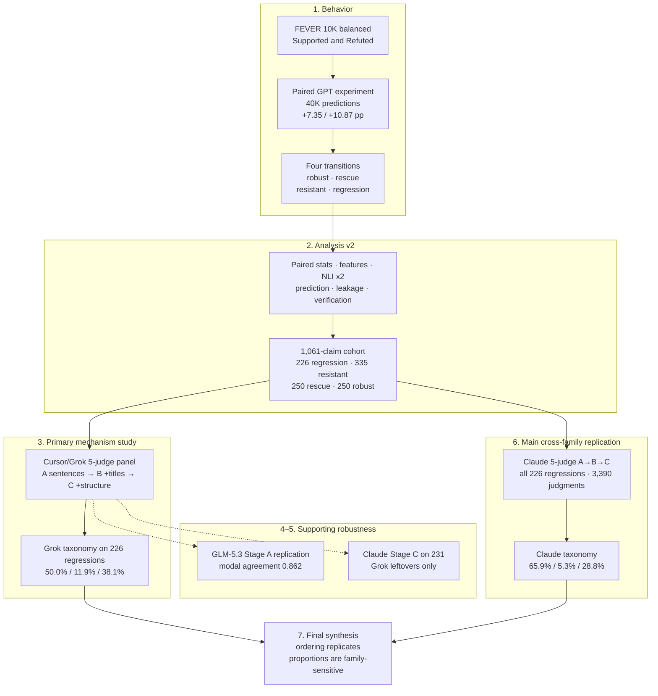
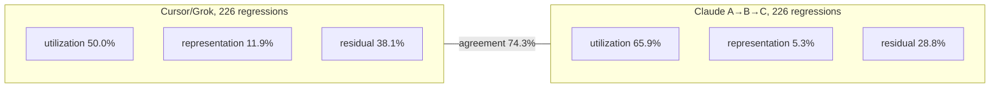

# Evidex

Evidex asks when designated gold evidence helps or harms LLM fact-checking, and what mechanisms explain cases where a model is correct without evidence and wrong after receiving it.

The experiments are finished. This repository is the research record: a 10,000-claim paired GPT study, a secondary analysis of those 40,000 predictions, and blinded silver adjudication under progressive disclosure. All adjudication is automated. It is not human annotation and does not relabel FEVER gold.

## How to read this study

1. **Primary behavioral experiment.** 10,000 balanced FEVER Supported/Refuted claims; GPT-5.4 and GPT-5.4-mini; no-evidence vs gold-evidence; 40,000 predictions.
2. **Primary analysis (`analysis_v2`).** Paired transitions, statistics, features, two local NLI diagnostics, leakage checks, verification.
3. **Primary mechanism study.** Cursor/Grok five-judge A→B→C progressive-disclosure panel on the diagnostic cohort.
4. **Supporting robustness.** GLM-5.3 Stage A replication against frozen Cursor Stage A.
5. **Intermediate cross-family robustness.** Claude Stage C panel on 231 Grok residual items.
6. **Main cross-family replication.** Claude five-judge A→B→C panel on all 226 unique regressions (3,390 judgments).
7. **Final synthesis.** The mixed-mechanism *ordering* replicates across judge families; the *exact proportions* are judge-family-sensitive.

Layers 4 and 5 are legitimate supporting experiments. They do not receive equal billing with the two complete A→B→C panels.

The map below is the research logic, not a file tree. Dashed edges are supporting or intermediate.



## Key findings

Denominators are not interchangeable. Claude residual Stage C and Claude full A→B→C answer different questions.

| Finding | Result | Denominator |
|---|---|---|
| GPT-5.4 evidence gain | 88.69% → 96.04% (**+7.35 pp**) | 10,000 claims |
| GPT-5.4-mini evidence gain | 84.67% → 95.54% (**+10.87 pp**) | 10,000 claims |
| Unique regressions | **226** claims (40 both models, 186 exactly one) | claims, not model-observations |
| Cursor/Grok mechanism split | **50.0%** utilization · **11.9%** representation-sensitive · **38.1%** residual ambiguity | 226 regressions |
| Claude full-panel mechanism split | **65.9%** utilization · **5.3%** representation-sensitive · **28.8%** residual ambiguity | same 226 regressions |
| Cross-family taxonomy agreement | **74.3%** exact and broad (κ = 0.537) | 226 paired assignments |
| GLM Stage A replication | modal verdict agreement **0.862** | 1,060 judged items |
| Claude residual split | **58.0%** persistent (134/231) · **42.0%** Grok-only (97/231) | 231 Stage C leftovers; supporting |



Both families independently find all three mechanisms, in the same rank order. Claude assigns more cases to evidence-utilization failure. That is a judge-family difference, not a confirmation that either split is human ground truth. Disagreement with FEVER does not establish FEVER annotation error.

Canonical write-up: [`CROSS_FAMILY_SYNTHESIS.md`](silver_adjudication_v1/claude_full_regression_panel/reports/CROSS_FAMILY_SYNTHESIS.md). Principal figure: [`fig1_mechanism_by_family.png`](silver_adjudication_v1/claude_full_regression_panel/figures/fig1_mechanism_by_family.png).

## Canonical reports

| Layer | Report |
|---|---|
| Analysis v2 | [`FINDINGS.md`](analysis_v2/reports/FINDINGS.md) · [`METHODS.md`](analysis_v2/reports/METHODS.md) |
| Cursor/Grok A→B→C | [`SILVER_FINDINGS.md`](silver_adjudication_v1/cursor_panel/reports/SILVER_FINDINGS.md) |
| Claude full A→B→C | [`CLAUDE_FINDINGS.md`](silver_adjudication_v1/claude_full_regression_panel/reports/CLAUDE_FINDINGS.md) |
| Final synthesis | [`CROSS_FAMILY_SYNTHESIS.md`](silver_adjudication_v1/claude_full_regression_panel/reports/CROSS_FAMILY_SYNTHESIS.md) |

Supporting reports (do not treat as the final mechanism paper):

| Layer | Report |
|---|---|
| GLM Stage A | [`CROSS_PANEL_STAGE_A_REPLICATION.md`](silver_adjudication_v1/cursor_panel/reports/CROSS_PANEL_STAGE_A_REPLICATION.md) |
| Claude residual Stage C | [`CLAUDE_FINDINGS.md`](silver_adjudication_v1/claude_residual_panel/reports/CLAUDE_FINDINGS.md) |
| Intermediate residual synthesis | [`FINAL_EVIDEX_STRENGTHENING.md`](silver_adjudication_v1/claude_residual_panel/reports/FINAL_EVIDEX_STRENGTHENING.md) |

Study-level docs: [`REPRODUCING.md`](REPRODUCING.md) · [`docs/STUDY_OVERVIEW.md`](docs/STUDY_OVERVIEW.md) · [`docs/DATA_PROVENANCE.md`](docs/DATA_PROVENANCE.md) · [`docs/ADJUDICATION_PROTOCOL.md`](docs/ADJUDICATION_PROTOCOL.md) · [`docs/LIMITATIONS.md`](docs/LIMITATIONS.md).

An earlier 1,000-claim run and the `*_pilot` files at the repository root are historical. They are not the manuscript experiment.

## Reproduce headline numbers

Committed summaries, tables, freezes, and reports are enough to verify the paper. No model API is required.

```powershell
python -m pip install pandas numpy scipy statsmodels pyarrow
python analysis_v2/src/verify_headlines.py
python silver_adjudication_v1/src/verify_headlines.py --panel cursor
python silver_adjudication_v1/src/verify_glm_stage_a.py
python silver_adjudication_v1/claude_residual_panel/src/verify_headlines.py
python silver_adjudication_v1/claude_full_regression_panel/src/verify_headlines.py
```

The Cursor command **requires** `--panel cursor`. Without that flag the shared verifier defaults to the incomplete GLM namespace.

`verify_glm_stage_a.py` recomputes the GLM–Cursor Stage A comparison from frozen judgments (1,060 items; modal agreement 0.862; consensus agreement 0.831) and does not write files.

Or: `python scripts/verify_all_headlines.py` — reads the research record and exits pass/fail. It does not mutate anything.

Level 2 analysis reproduction and optional Level 3 model inference are in [`REPRODUCING.md`](REPRODUCING.md). Re-running GPT or judges is not required and will not reproduce the frozen record bit-for-bit.

## Limitations

- **Automated judges, not humans.** Cursor/Grok, GLM, and Claude panels are model-based silver labels. Cross-family replication reduces the risk that findings reflect one judge family. It is not a substitute for expert human adjudication.
- **FEVER remains the gold standard.** NLI disagreement and model-judge disagreement flag candidate ambiguity. They do not establish that a FEVER label is incorrect.
- **No causal claim about GPT internals.** Progressive disclosure locates where a judge panel's warrant changes. Original GPT runs recorded labels only.
- **Binary, 2017-era FEVER.** The design excludes NOT ENOUGH INFO and is Wikipedia-based and entity-centric.
- **Proportions are judge-family-sensitive.** The mixed-mechanism *picture* is robust; the 50.0% vs 65.9% utilization split is not a single universal constant.

Fuller lists: [`docs/LIMITATIONS.md`](docs/LIMITATIONS.md).

## License and third-party data

Project **code** is under the MIT License ([`LICENSE`](LICENSE)). That license does **not** relicense FEVER, Wikipedia text, or other third-party material committed as data. See [`docs/DATA_PROVENANCE.md`](docs/DATA_PROVENANCE.md) before redistributing data files.

## Citation

See [`CITATION.cff`](CITATION.cff).
