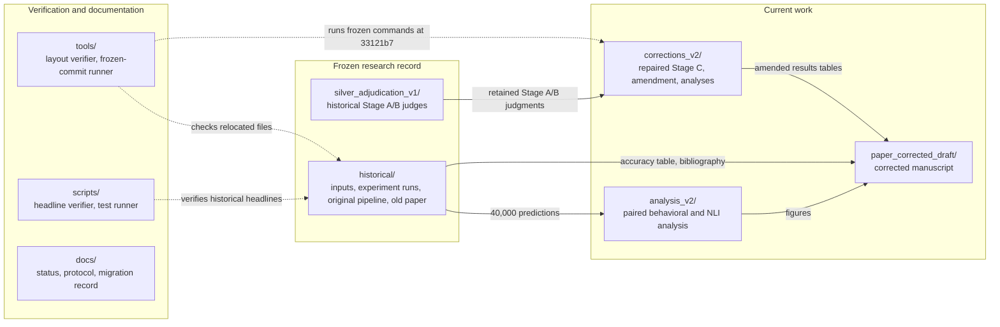

# Evidex

Evidex evaluates how supplying FEVER-designated evidence changes claim-verification predictions. The paired study contains 40,000 predictions on 10,000 claims; the corrected manuscript examines 226 distinct correct-to-wrong regressions.

**Read the current paper:** [corrected draft PDF](paper_corrected_draft/evidex-corrected-draft.pdf) and [source](paper_corrected_draft/). The older manuscript in `historical/paper/` contains withdrawn adjudication claims and is retained as part of the research record.

## Repository map


```mermaid
flowchart LR
  subgraph current["Current work"]
    paper["paper_corrected_draft/<br/>corrected manuscript"]
    corr["corrections_v2/<br/>repaired Stage C, amendment, analyses"]
    ana["analysis_v2/<br/>paired behavioral and NLI analysis"]
  end

  subgraph record["Frozen research record"]
    silver["silver_adjudication_v1/<br/>historical Stage A/B judges"]
    hist["historical/<br/>inputs, experiment runs, original pipeline, old paper"]
  end

  subgraph support["Verification and documentation"]
    tools["tools/<br/>layout verifier, frozen-commit runner"]
    scripts["scripts/<br/>headline verifier, test runner"]
    docs["docs/<br/>status, protocol, migration record"]
  end

  hist -->|"40,000 predictions"| ana
  silver -->|"retained Stage A/B judgments"| corr
  corr -->|"amended results tables"| paper
  ana -->|"figures"| paper
  hist -->|"accuracy table, bibliography"| paper
  tools -.->|"checks relocated files"| hist
  tools -.->|"runs frozen commands at 33121b7"| corr
  scripts -.->|"verifies historical headlines"| hist
```

## Directory guide

| Directory | Contents |
|---|---|
| `paper_corrected_draft/` | Current manuscript, generated tables and figures |
| `corrections_v2/` | Evidence repair, fixed packets, accepted Stage C outputs, amendment and analyses |
| `analysis_v2/` | Paired behavioral analysis and NLI diagnostics |
| `silver_adjudication_v1/` | Historical A/B judges and supporting panels |
| `historical/inputs/` | FEVER sample and provenance files |
| `historical/experiment/` | Full 10,000-claim experiment runs and predictions |
| `historical/behavioral_results/` | Original summary tables and error cases |
| `historical/pilot/` | Earlier 1,000-claim and pilot artifacts |
| `historical/pipeline/` | Original behavior-study scripts, preserved byte-for-byte |
| `historical/parallel_shards_balanced_10000_v1/` | Result and run files from the four parallel shards of the 10,000-claim experiment's remaining claims |
| `historical/paper/` and `historical/archive_old_pipeline/` | Superseded manuscript and older pipeline |
| `docs/` | Current status, technical notes and historical documents |
| `tools/` | Layout verifier and frozen-commit runner |
| `scripts/` | Headline verifier, test runner and repository inventory |

The root was organized after the scientific record was frozen. The original artifact tag `evidex-artifact-v1` and pre-layout correction commit `33121b7` remain unchanged. [The migration record](docs/post_judgment/LAYOUT_MIGRATION_2026-09-28.md) explains how relocated bytes and old commands are checked. This branch changes presentation paths, not the predictions or judgments.

## Check the record

```bash
python tools/verify_layout.py
python tools/run_frozen.py -- python corrections_v2/verify_outputs.py
python tools/run_frozen.py -- python scripts/verify_all_headlines.py
python paper_corrected_draft/check_draft.py
```

The original correction programs refer to old root paths. Run them through `tools/run_frozen.py`, which checks this layout, creates a temporary checkout of the unchanged pre-layout commit, runs the command there, and removes that checkout. See [REPRODUCING.md](REPRODUCING.md) for the full verification sequence and its limits.

The corrected adjudication is post hoc. It uses a dated amendment to select accepted Stage C outputs; the frozen protocol's original primary status remains incomplete. See [current status](docs/CURRENT_STATUS.md) before citing a result. FEVER/Wikipedia data retain their third-party terms; the MIT license covers project code only.
