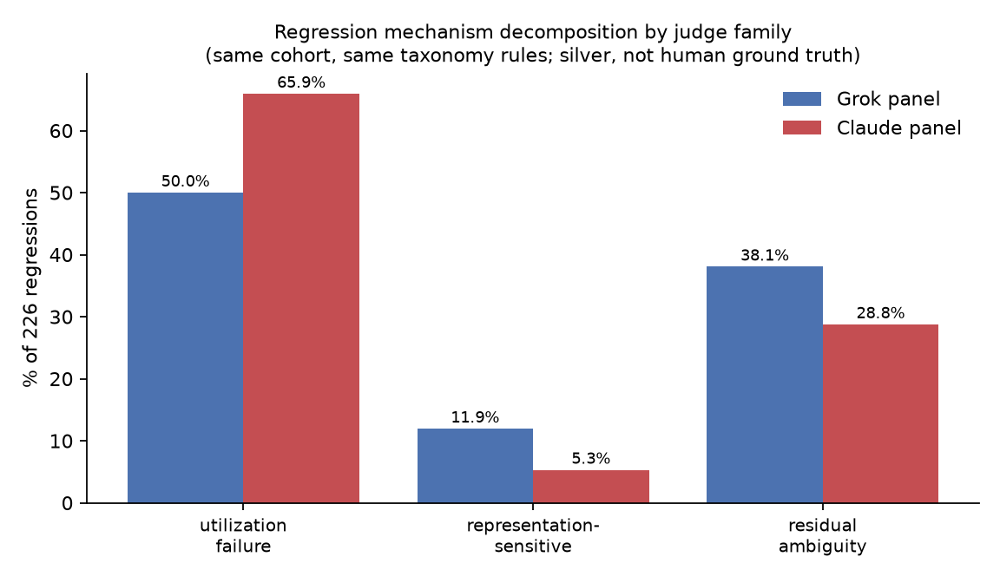
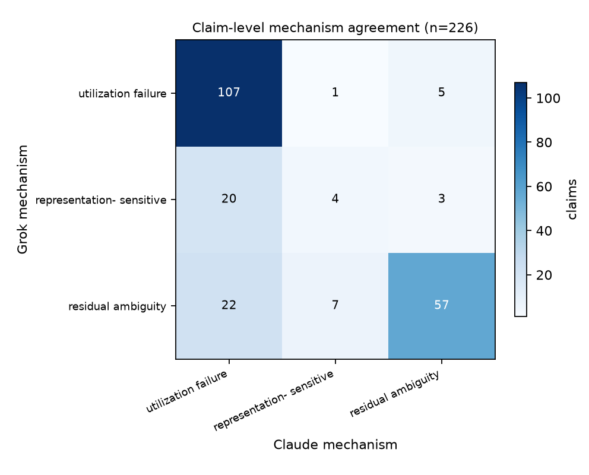
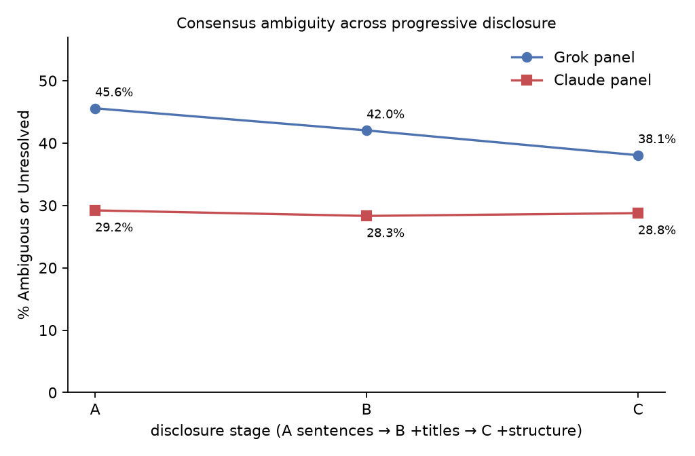

# Claude cross-family replication of the regression mechanism decomposition

**Question.** Does a fully independent Claude A→B→C panel on all 226 GPT
regressions reproduce the mixed-mechanism picture originally derived from the
Cursor/Grok panel?

**Short answer.** The *existence* of all three mechanisms replicates; the
*proportions* do not. Both judge families independently find that regressions
are a mixture — a majority of clear evidence-utilization failures, a substantial
minority where the designated evidence never warranted a decisive verdict, and a
small representation-sensitive slice. But Claude assigns markedly more cases to
utilization failure (65.9% vs 50.0%) and correspondingly fewer to residual
ambiguity (28.8% vs 38.1%) and representation sensitivity (5.3% vs 11.9%). The
qualitative claim "regressions are not a single failure mode" survives the
family swap. Any specific split — in particular the headline "half of
regressions are utilization failures" — does not, and should be read as
judge-family-dependent.

This is **cross-family silver validation, not human validation.** Two model
families agreeing does not establish human ground truth, and their disagreement
does not establish that either is right.

---

## 1. What was run

| | |
|---|---|
| Cohort | 226 unique GPT regressions (correct without evidence → incorrect with designated FEVER evidence, union over both GPT models) |
| Judges | five isolated judges, fresh subagent per `(judge, batch, stage)` |
| Stages | A (evidence sentences) → B (+ page titles) → C (+ structured FEVER evidence) |
| Model | `claude-opus-5-thinking-high`, locked; no Auto, no fallback |
| Judgments | 226 × 5 × 3 = **3,390**, all schema-valid, no duplicates, no retries |
| Freeze | all three stages frozen and hash-verified *before* any unblinding |

The cohort was recomputed independently from `analysis_v2` rather than trusted
from the existing manifest, and matched the frozen shared cohort claim-for-claim
at exactly 226 (40 both models / 75 `gpt-5.4` only / 111 `gpt-5.4-mini` only).

Judges saw only a claim and its evidence under an opaque `CF-*` id. They never
saw the FEVER label, either GPT model's prediction, the fact that these items
were selected for regressing, NLI outputs, Grok judgments, the existing taxonomy,
or the earlier Claude residual panel's judgments.

## 2. Claude's own panel behaviour

Inter-judge reliability was high and stable across disclosure stages, so the
decomposition below is not an artifact of a noisy panel:

| Stage | Fleiss κ | pairwise agreement | high-consensus rate | ambiguous/unresolved |
|---|---|---|---|---|
| A | 0.897 | 93.4% | 70.8% | 29.2% |
| B | 0.904 | 93.8% | 71.7% | 28.3% |
| C | 0.884 | 92.6% | 71.2% | 28.8% |

Claude's consensus barely moves as evidence representation is enriched:
progressive disclosure resolved 4.0% of items at titles and a further 3.1% only
at structured evidence, and **no** item's decisive verdict reversed at either
step. Ambiguity ends essentially where it started (29.2% → 28.3% → 28.8%).

## 3. Mechanism decomposition, both families, same rules

Identical cohort, identical taxonomy code (copied verbatim from
`join_analysis_v2.py`), applied to each family's own consensus:

| Mechanism | Grok n (%) | Claude n (%) |
|---|---|---|
| evidence-utilization failure | 113 (50.0%) | 149 (65.9%) |
| representation-sensitive | 27 (11.9%) | 12 (5.3%) |
| residual ambiguity | 86 (38.1%) | 65 (28.8%) |

Finer categories: Claude's representation-sensitive slice is entirely
structured-evidence-sensitive (12); it produced **zero** title-context-sensitive
cases, where Grok found 15. Claude left no items in the `other`/unresolved
bucket.

## 4. Claim-level agreement

Because Claude produced no `title_context_sensitive` and no `other` labels, the
exact and broad-category agreement rates coincide at **74.3%** (168/226),
Cohen's κ = 0.54 — moderate, well above chance, well short of interchangeable.

Confusion matrix (rows Grok, columns Claude):

| | util. failure | repr.-sensitive | residual amb. |
|---|---|---|---|
| **utilization failure** | 107 | 1 | 5 |
| **representation-sensitive** | 20 | 4 | 3 |
| **residual ambiguity** | 22 | 7 | 57 |

The disagreement is directional, not random. Where the two families differ,
Claude overwhelmingly moves cases *into* utilization failure: 20 of Grok's 27
representation-sensitive cases and 22 of Grok's 86 residual-ambiguity cases
become utilization failures under Claude, while only 6 cases move the other way.
In plain terms, Claude more often judges the designated evidence to be
genuinely decisive — and therefore reads the GPT error as a failure to use
adequate evidence, rather than as an artifact of thin or badly represented
evidence.

## 5. Stage-level comparison

| Measure | Grok | Claude | Δ (pp) | McNemar p |
|---|---|---|---|---|
| Stage A ambiguity | 45.6% | 29.2% | −16.4 | 7.8e-10 |
| Stage B ambiguity | 42.0% | 28.3% | −13.7 | 3.4e-07 |
| Stage C ambiguity | 38.1% | 28.8% | −9.3 | 7.5e-04 |
| resolved by titles | 7.1% | 4.0% | −3.1 | 0.14 |
| resolved only by structure | 5.3% | 3.1% | −2.2 | 0.36 |
| reversal after titles/structure | 0.0% | 0.0% | 0.0 | 1.00 |

Claude is systematically less willing to call an item ambiguous, and the gap is
large and statistically robust at every stage. The gap *narrows* monotonically
across disclosure (−16.4 → −13.7 → −9.3 pp), because Grok's ambiguity falls with
richer evidence while Claude's is already low and stays flat. Neither family
reversed a decisive verdict at any disclosure step — a genuine agreement, and
evidence that the representation-sensitive category is driven by
ambiguity-resolution rather than by verdict flips.

## 6. Shared vs model-specific regressions

Regressions occurring in **both** GPT models (n=40) are markedly more likely to
be residual ambiguity than those occurring in exactly one model (n=186):
47.5% vs 24.7% under Claude (OR 2.75, 95% CI 1.36–5.57, p = 0.0065). Grok shows
the same direction (60.0% vs 33.3%).

This is the clearest cross-family agreement in the study, and it is the one that
matters most for interpreting the benchmark: when both GPT models regress on the
same claim, the designated evidence is disproportionately the problem. When only
one regresses, it is disproportionately that model failing to use adequate
evidence. Treated as exploratory — one pre-specified subgroup contrast on 40
items.

## 7. Conclusions, separated by robustness

**Robust across both judge families.**
- Regressions are a mixture of mechanisms, not one failure mode. All three
  categories are non-trivially populated in both panels.
- Evidence-utilization failure is the single largest mechanism (both ≥50%).
- A substantial minority of regressions involve evidence that does not clearly
  warrant the expected verdict (both ≥28.8%): the benchmark's designated
  evidence is not uniformly sufficient.
- Representation sensitivity is real but the smallest mechanism (both ≤11.9%).
- Enriching evidence representation resolves ambiguity but flips no decisive
  verdict (0.0% reversals in both panels).
- Shared regressions skew toward residual ambiguity relative to
  model-specific ones.

**Quantitatively different but directionally consistent.**
- The rank order of the three mechanisms is identical in both families
  (utilization > residual > representation), but the magnitudes differ by
  9–16 pp.
- Ambiguity declines or is flat across A→B→C in both families; the slopes differ.

**Judge-family-sensitive — do not quote as a stable property of the benchmark.**
- Any specific mechanism percentage, including the "50% utilization failure /
  38% residual ambiguity" split. Substituting judge family moves these by up to
  16 pp.
- The absolute ambiguity rate at any stage (45.6% vs 29.2% at Stage A).
- Whether title context specifically matters: Grok found 15
  title-context-sensitive regressions, Claude found none.

**Unresolved without human adjudication.**
- The 58 claims where the two families disagree on mechanism. Nothing in this
  study identifies which family is closer to a human verdict.
- Whether Grok is over-calling ambiguity or Claude is under-calling it. The two
  are observationally equivalent here, and the honest summary is that the
  boundary between "evidence was insufficient" and "the model failed to use
  sufficient evidence" is judge-dependent at roughly the 15 pp scale.
- Whether any FEVER item is mis-annotated. Model disagreement with FEVER is not
  evidence of annotation error.

Nothing here supports claims about GPT's internal reasoning; the panel observed
only claims, evidence and verdicts.

## 8. Verification

- `python src/verify_headlines.py` recomputes every number above from the frozen
  raw judge files, on a path that does not import the analysis modules, and
  checks each display string appears in this report.
- `python -m pytest tests` covers cohort size, blinding, progressive disclosure,
  model lock, schema, consensus-rule and taxonomy equivalence with the shared
  pipeline, completeness, freeze integrity, and non-mutation of the frozen
  Cursor/Grok and Claude-residual experiments.
- Protocol deviations, including the blinding-path fix, the capacity
  interruption and a duplicate-run tie-break, are recorded in
  `ADJUDICATION_LOG.md`. Scope limits are in `LIMITATIONS.md`.
